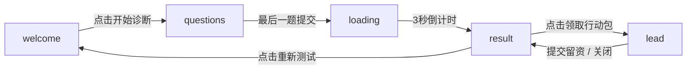

# 出海老板MBTI诊断工具 - 开发规划文档

## 项目概述

- **项目名称**: mktmbti2
- **技术栈**: React 18 + Tailwind CSS 3 + Framer Motion + Recharts
- **项目类型**: SPA单页应用（状态机控制页面切换）
- **目标用户**: 中国工厂老板（移动端优先）

---

## 一、页面状态机设计

### 状态定义

```
AppState = 'welcome' | 'questions' | 'loading' | 'result' | 'lead'
```

### 状态转换图




### 触发条件


| 当前状态      | 触发事件        | 目标状态      |
| --------- | ----------- | --------- |
| welcome   | 用户点击"开始诊断"  | questions |
| questions | 用户完成第24题    | loading   |
| loading   | 3秒倒计时结束     | result    |
| result    | 用户点击"领取行动包" | lead      |
| result    | 用户点击"重新测试"  | welcome   |
| lead      | 用户提交表单      | result    |
| lead      | 用户点击关闭      | result    |


---

## 二、数据结构定义

### Question (题目对象)

```typescript
interface Question {
  id: number;              // 1-24
  text: string;            // 题目文本
  type: 'scale' | 'choice'; // 量表题 or 选择题
  dimension: string;       // 所属维度: 'capacity' | 'market' | 'action' | 'decision'
  options?: {              // 选择题选项
    value: number;
    label: string;
  }[];
}
```

### Answer (答案记录)

```typescript
interface Answer {
  questionId: number;
  value: number | string;  // 量表: 1-5, 选择题: 选项值
}
```

### Result (诊断结果)

```typescript
interface Result {
  type: 'A' | 'B' | 'C' | 'D' | 'E';  // 5种画像
  dimensions: {
    capacity: number;      // 产能底气 0-100
    market: number;        // 市场嗅觉 0-100
    action: number;       // 行动惯性 0-100
    decision: number;      // 决策算账 0-100
  };
  summary: string;         // 一句话总结
  strengths: string[];     // 家底盘点
  weakness: string;        // 唯一缺口
  opportunity: string;     // 机会路径
  actions: string[];      // 具体动作（3步）
  reminder: string;        // 真诚提醒
  actionPackage: string[]; // 行动包清单
}
```

### Lead (留资信息)

```typescript
interface Lead {
  name: string;
  phone: string;
  wechat: string;
}
```

---

## 三、组件树拆解

```
App
├── Welcome (欢迎页)
│   └── GradientButton
├── Questions (答题页)
│   ├── ProgressBar
│   ├── QuestionCard
│   │   ├── QuestionText
│   │   └── ScaleSelector (量表模式)
│   │   └── ScaleButton × 5
│   │   └── ChoiceSelector (选择模式)
│   │       └── ChoiceOption × N
│   └── NextButton
├── Loading (加载页)
│   └── PulseRings (动态脉冲环)
├── Result (结果页)
│   ├── ResultHero
│   │   └── RadarChart (雷达图)
│   ├── SectionCard ("你的家底")
│   ├── SectionCard ("唯一缺口")
│   ├── SectionCard ("机会路径")
│   ├── ActionSteps (3步动作)
│   ├── SectionCard ("说句实在话")
│   ├── ActionPackageCard
│   └── ActionButton ("领取行动包")
│   └── RestartLink
└── LeadModal (留资弹窗)
    ├── CloseButton
    ├── ModalTitle
    ├── LeadForm
    │   ├── InputField (姓名)
    │   ├── InputField (手机号)
    │   └── InputField (微信号)
    └── SubmitButton
```

---

## 四、状态管理方案

### 推荐方案: useState + Context

**理由**:

1. 应用规模适中，无需 Redux/Zustand 的复杂度
2. 页面级状态（当前页、当前题目、用户答案）相对简单
3. Context 可优雅共享跨组件状态
4. 减少外部依赖，维护成本低

### 备选方案: Zustand

适用于未来扩展（如需要持久化、中间件、复杂状态逻辑）

### 状态结构设计

```typescript
interface AppContextState {
  currentPage: AppState;
  currentQuestion: number;      // 1-24
  answers: Record<number, number | string>;
  result: Result | null;
  lead: Lead | null;
}
```

### 状态更新函数

- `setPage(page)` - 页面切换
- `submitAnswer(questionId, value)` - 提交答案
- `calculateResult()` - 计算结果
- `submitLead(lead)` - 提交留资
- `reset()` - 重置所有状态

---

## 五、第三方库依赖清单


| 库名            | 版本      | 用途    | 安装命令                                              |
| ------------- | ------- | ----- | ------------------------------------------------- |
| react         | ^18.2.0 | 核心框架  | `npm install react react-dom`                     |
| react-dom     | ^18.2.0 | DOM渲染 | (随react安装)                                        |
| framer-motion | ^11.0.0 | 动画引擎  | `npm install framer-motion`                       |
| recharts      | ^2.12.0 | 雷达图   | `npm install recharts`                            |
| tailwindcss   | ^3.4.0  | 样式框架  | `npm install -D tailwindcss postcss autoprefixer` |
| autoprefixer  | ^10.4.0 | CSS前缀 | (随tailwind安装)                                     |
| postcss       | ^8.4.0  | CSS处理 | (随tailwind安装)                                     |


### package.json 完整依赖

```json
{
  "dependencies": {
    "react": "^18.2.0",
    "react-dom": "^18.2.0",
    "framer-motion": "^11.0.0",
    "recharts": "^2.12.0"
  },
  "devDependencies": {
    "tailwindcss": "^3.4.0",
    "postcss": "^8.4.0",
    "autoprefixer": "^10.4.0",
    "vite": "^5.0.0",
    "@vitejs/plugin-react": "^4.2.0"
  }
}
```

---

## 六、文件结构规划

### 推荐结构（单文件优先）

根据需求约束（代码在一个 App.jsx + 一个 index.css），采用简化结构：

```
mktmbti2/
├── package.json
├── vite.config.js
├── tailwind.config.js
├── postcss.config.js
├── index.html
└── src/
    ├── main.jsx           # 入口文件
    ├── App.jsx             # 全部页面逻辑 + 状态管理 + 组件
    ├── index.css           # Tailwind基础 + 自定义动画 + 全局字体
    └── data/
        └── questions.js    # 24题题目数据
        └── results.js       # 5种画像诊断内容
```

### 详细文件说明


| 文件                      | 职责                              |
| ----------------------- | ------------------------------- |
| `src/App.jsx`           | 包含所有组件定义、状态管理、页面渲染逻辑            |
| `src/index.css`         | Tailwind指令、全局样式、自定义动画keyframes  |
| `src/data/questions.js` | 24道题目数据（id、text、type、dimension） |
| `src/data/results.js`   | 5种画像的诊断内容模板                     |


### 备选结构（大型项目扩展）

如需更好的可维护性，可拆分:

```
src/components/
├── Welcome.jsx
├── Questions.jsx
├── Loading.jsx
├── Result.jsx
├── LeadModal.jsx
├── ui/
│   ├── GradientButton.jsx
│   ├── ScaleButton.jsx
│   ├── ProgressBar.jsx
│   └── SectionCard.jsx
└── charts/
    └── RadarChart.jsx
```

---

## 七、实现优先级

### Phase 1: 基础搭建

1. 初始化 Vite + React 项目
2. 配置 Tailwind CSS
3. 配置 Framer Motion
4. 创建基础 App 骨架 + 状态机

### Phase 2: 页面开发

1. Welcome 欢迎页
2. Questions 答题页（含量表交互）
3. Loading 加载页
4. Result 结果页（最复杂）
5. LeadModal 留资弹窗

### Phase 3: 数据与逻辑

1. 24题题目数据
2. 5种画像逻辑
3. 雷达图计算
4. 留资表单验证

### Phase 4: 动效打磨

1. 页面切换动画
2. 元素入场动画
3. 交互反馈动画
4. 加载页脉冲效果

---

## 八、技术决策建议

### 雷达图方案

**推荐**: recharts 的 RadarChart

- 支持响应式
- 动画开箱即用
- 定制化能力强

### 动画方案

**推荐**: 纯 Framer Motion

- 与 React 集成最佳
- 语法简洁
- 性能优秀

### 移动端适配

- 所有间距使用 `px-4 sm:px-6`
- 触摸目标 ≥ 44px
- 字体使用响应式 `text-lg sm:text-xl`

